# Insights

En primer instancia, teniendo un análisis comparativo de la evolución histórica de defunciones por causa en Centroamérica (2015-2023) revela que el shock de mortalidad asociado a la pandemia se concentró mayoritariamente en la categoría de infecciones respiratorias y tuberculosis (CG0390), y no en la categoría específica de COVID-19 (CG0995), cuyo volumen registrado fue consistentemente menor en los seis países analizados. Este desacople entre ambas categorías sugiere un patrón de subregistro o clasificación imprecisa de la causa de muerte durante el período crítico 2020-2021, fenómeno que se observa con mayor intensidad en Guatemala y Honduras —donde las defunciones por infecciones respiratorias alcanzaron picos de aproximadamente 38,000 y 25,000 casos respectivamente— en contraste con Costa Rica y Panamá, donde el incremento fue marginal y casi imperceptible frente a la tendencia histórica. Por otro lado, causas crónicas estructurales como los trastornos neurológicos (CG0590) y las enfermedades cardiovasculares (CG0530) mantuvieron una tendencia secular ascendente sin alteraciones visibles durante la pandemia, evidenciando que la crisis sanitaria fue un choque agudo y transitorio superpuesto a una carga de enfermedad crónica preexistente que continuó su curso independiente del contexto pandémico. Finalmente, la caída abrupta de ambas categorías pandémicas hacia 2022-2023 debe interpretarse con cautela, ya que podría reflejar tanto una recuperación epidemiológica real como un rezago en la consolidación de datos de los años más recientes, una limitación común en fuentes de estadísticas vitales que debe documentarse explícitamente en el informe de consultoría.

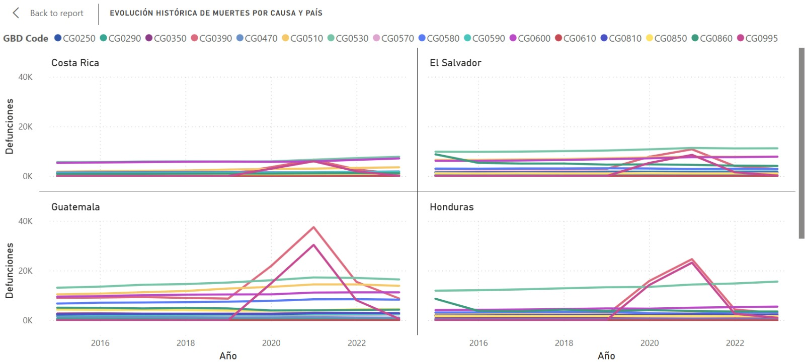
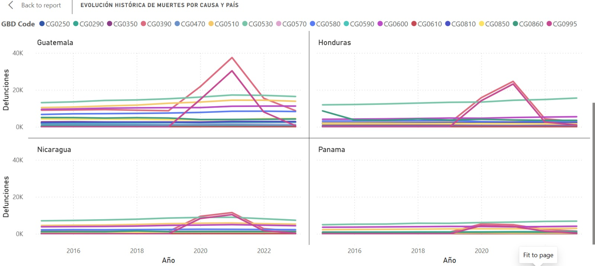

El análisis del total acumulado de defunciones por país (todas las causas, todo el período disponible) confirma a Guatemala como el país con la mayor carga absoluta de mortalidad en Centroamérica, con 779,300 defunciones registradas, una cifra que representa aproximadamente el 34% del total regional y casi duplica el volumen del segundo país en la lista, Honduras (446,200). 

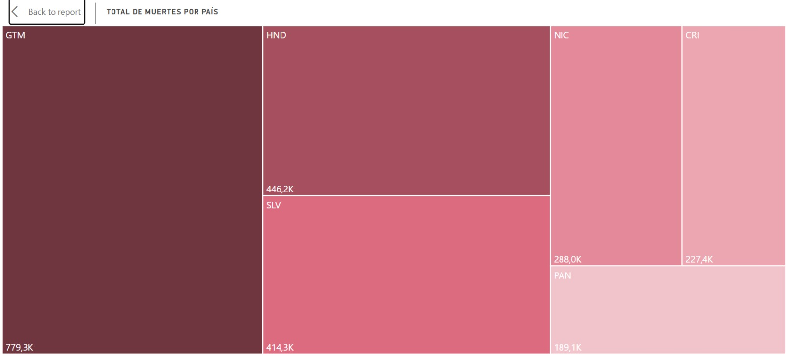

La comparación de mortalidad pre-COVID (2015-2019) y post-COVID (2020-2023) en Guatemala muestra un incremento de 361,395 a 417,953 defunciones, equivalente a 56,558 muertes adicionales y una variación relativa de +15.65%, la mayor diferencia absoluta registrada entre los seis países centroamericanos analizados. Al contrastar este resultado con el resto de la región, se observa que Honduras presenta el incremento porcentual más alto (+23.29%), seguido de Nicaragua (+17.96%), ambos por encima del crecimiento relativo de Guatemala, lo que indica que, si bien Guatemala concentra el mayor volumen absoluto de muertes adicionales, no es el país donde la mortalidad creció proporcionalmente más durante el período post-COVID. Por su parte, El Salvador constituye el único caso atípico de la región, con una variación negativa de -2.29% (de 209,537 a 204,743 defunciones), siendo el único país donde el total de defunciones del período post-COVID resultó inferior al del período pre-COVID. El resto de los países (Costa Rica, Panamá) se ubican en un rango de crecimiento similar, entre 11% y 14%, lo que sitúa a Guatemala dentro de un patrón regional de incremento generalizado de la mortalidad, pero sin ser el caso de mayor intensidad relativa.

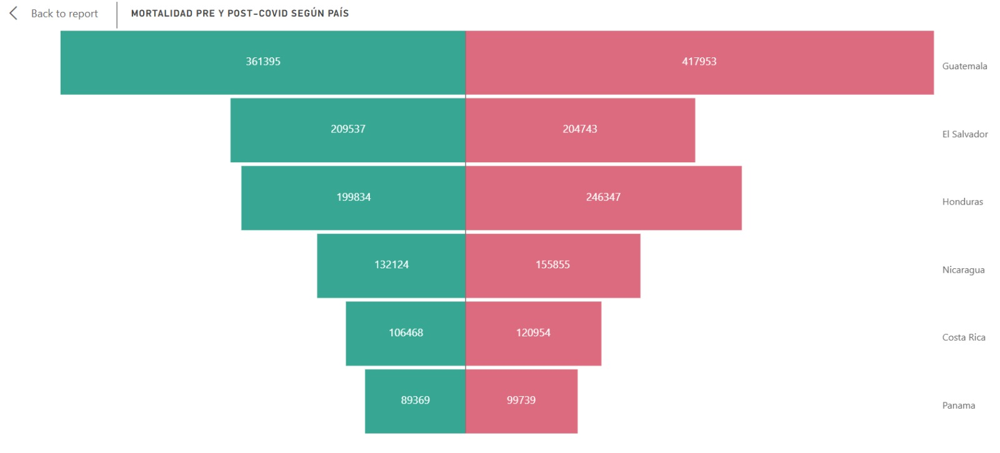

La comparativa regional con IHME se complementa con la visualización **Tendencia de Causas en Centroamérica (IHME)**, construida en Apache Superset sobre la misma lógica analítica de comparación regional usada en Power BI. Esta gráfica permite contrastar la trayectoria anual de muertes por país y ubicar a Guatemala frente al resto de Centroamérica, reforzando la lectura de que el choque pandémico no fue homogéneo en la región y que las diferencias entre países deben interpretarse junto con las limitaciones de registro y clasificación de causas.

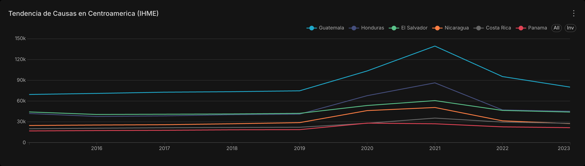

La comparación entre los principales perfiles de mortalidad de Guatemala y Panamá revela que Cardiovascular diseases constituye la primera causa de muerte en ambos países, lo que indica un patrón compartido en la principal causa de mortalidad de la región. Sin embargo, el resto del perfil de causas diverge de forma notable: en Guatemala, Diabetes and kidney diseases ocupa el segundo lugar con aproximadamente 120,000 defunciones acumuladas, una cifra ocho veces mayor que la registrada para la misma causa en Panamá (~15,000), lo que evidencia un peso desproporcionadamente alto de esta condición dentro del perfil de mortalidad guatemalteco. Asimismo, COVID-19 figura como la octava causa principal en el top 10 de Guatemala (~27,000 defunciones), mientras que no aparece como categoría individual dentro del top 10 de Panamá, donde en cambio se observan categorías de clasificación más genérica, como "Causas externas de morbilidad y mortalidad" y "Códigos para propósitos especiales", que en conjunto superan las 49,000 defunciones. Esta diferencia sugiere que ambos países emplean esquemas de clasificación de causa de muerte con distinto nivel de granularidad, lo cual debe documentarse como una limitación de comparabilidad entre fuentes heterogéneas dentro del informe de consultoría. Adicionalmente, Self-harm and interpersonal violence aparece como séptima causa en Guatemala (~37,000 defunciones) sin una categoría equivalente visible en el top 10 panameño, lo que podría apuntar a diferencias reales en la incidencia de esta causa entre ambos países, o bien a diferencias en su clasificación y registro.

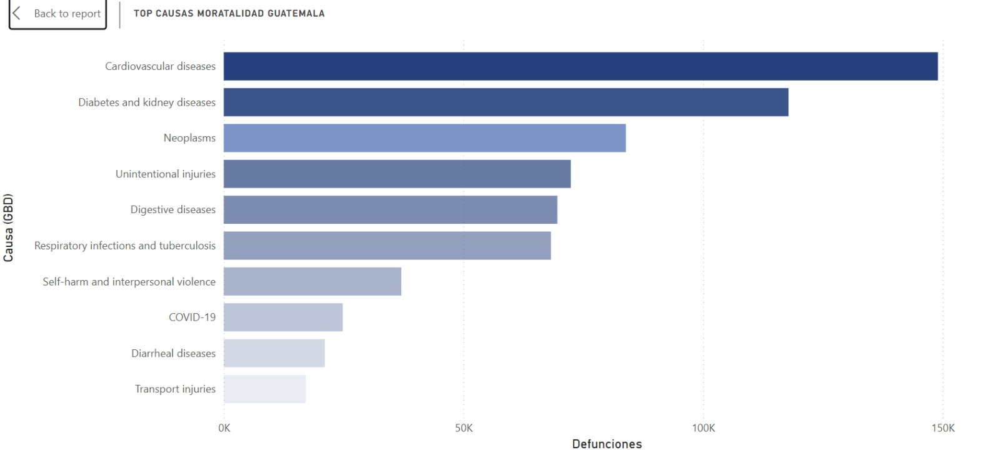
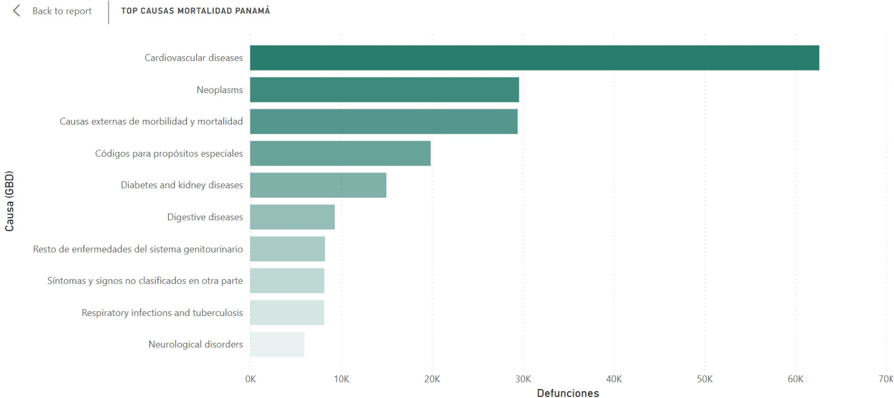

La tendencia histórica de defunciones anuales en Guatemala muestra un comportamiento estable entre 2015 y 2019 (de aproximadamente 81,000 a 86,000 muertes anuales), seguido de un incremento marcado a partir de 2020 que alcanza su punto máximo en 2021 con cerca de 120,000 defunciones, el valor más alto de toda la serie histórica disponible. Tras este pico, la mortalidad en Guatemala desciende a aproximadamente 96,000 en 2022, pero se mantiene de forma sostenida por encima de los niveles pre-pandemia durante 2022, 2023 y 2024 (en torno a 96,000-100,000), sin retornar a la tendencia previa a 2020. Al comparar este comportamiento con Panamá, se observa que ambos países comparten la misma forma de curva —estabilidad, pico en 2021 y descenso posterior—, lo que sugiere que el quiebre de tendencia ocurrió en el mismo período para ambos países; sin embargo, Panamá muestra un patrón de recuperación más cercano a sus niveles pre-pandemia hacia 2023 (~23,000, frente a ~21,000 en 2019), mientras que Guatemala no logra volver a su nivel histórico previo en ningún punto de la serie posterior a 2021. Esta diferencia en la trayectoria de recuperación post-pico constituye un hallazgo relevante para el análisis comparativo pre/post-COVID, en la medida en que sugiere una persistencia más prolongada del exceso de mortalidad en Guatemala respecto a Panamá.

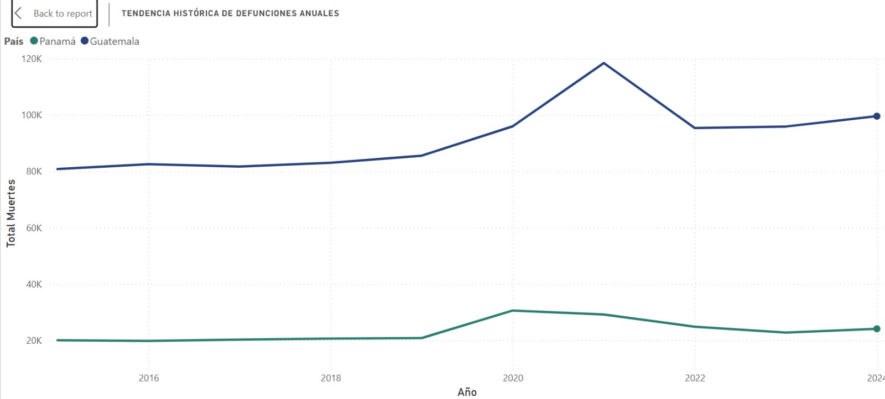

Estos hallazgos iniciales de Power BI se amplían con los dashboards de Apache Superset, que permiten profundizar el análisis en tres dimensiones: comparación pre/post-COVID, perfil de causas de muerte y distribución geográfica-demográfica dentro de Guatemala.


## Insights de Apache Superset

Los dashboards de Apache Superset profundizan el análisis en tres dimensiones complementarias a Power BI: la comparación temporal pre y post-COVID, el perfil detallado de causas de muerte y la distribución geográfica y demográfica dentro de Guatemala. Cada dashboard se construye sobre las mismas vistas del Data Warehouse local (Greenplum), garantizando consistencia entre ambas herramientas de BI.

El primer dashboard compara la mortalidad total antes y después de la pandemia. Entre 2015 y 2019 se registraron aproximadamente 414 mil defunciones en Guatemala, lo que representa la línea base pre-COVID. A partir de 2020, el total asciende a 505 mil defunciones, un incremento de 91 mil muertes adicionales que equivale a un **+22.2%** de crecimiento relativo entre ambos períodos.


La desagregación mensual de la serie 2015–2024 permite observar con claridad el choque pandémico: la tendencia estable de los años pre-COVID se rompe abruptamente en 2020 con un pico que alcanza su punto máximo en 2021, seguido de un descenso que no retorna completamente a los niveles previos a la pandemia. Las defunciones mensuales en 2022, 2023 y 2024 se mantienen sistemáticamente por encima del promedio 2015–2019, evidenciando un exceso de mortalidad persistente.

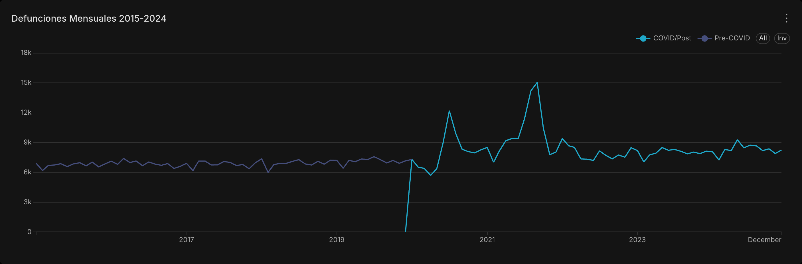

La comparación año por año confirma que 2021 fue el año más letal de la serie, seguido de 2020 y 2022. El período pre-COVID (2015–2019) muestra una progresión gradual mientras que los años post-COVID se mantienen elevados de forma sostenida, sin señales de retorno a la tendencia prepandémica incluso cuatro años después del inicio de la crisis sanitaria.

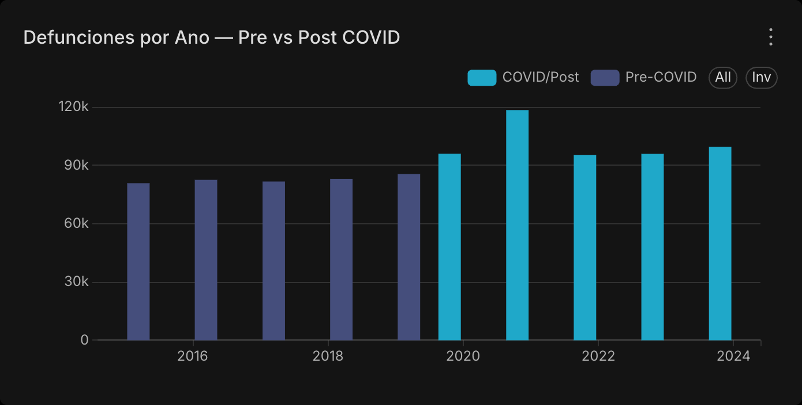

La validación contra datos oficiales del MSPAS muestra que la tasa de mortalidad por cada 100 mil habitantes, que rondaba valores estables en el período pre-COVID, experimentó un quiebre marcado a partir de 2020. Dado que la tasa oficial del MSPAS solo está disponible hasta 2019, los años posteriores solo registran el conteo absoluto de defunciones, limitación que debe considerarse al interpretar la continuidad de la serie.

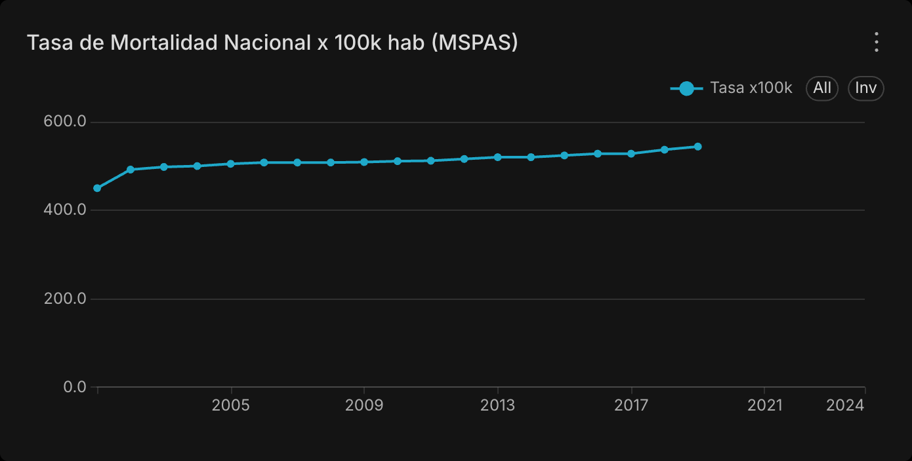

---

El segundo dashboard desglosa las causas de muerte según la clasificación GBD Nivel 2. El treemap de causas dominantes revela que las enfermedades cardiovasculares, la diabetes y enfermedades renales, y las neoplasias concentran la mayor parte de las defunciones en Guatemala, seguidas de las causas externas y las infecciones respiratorias. COVID-19 aparece como causa identificable pero no entre las primeras posiciones del ranking absoluto del período completo 2015–2024.

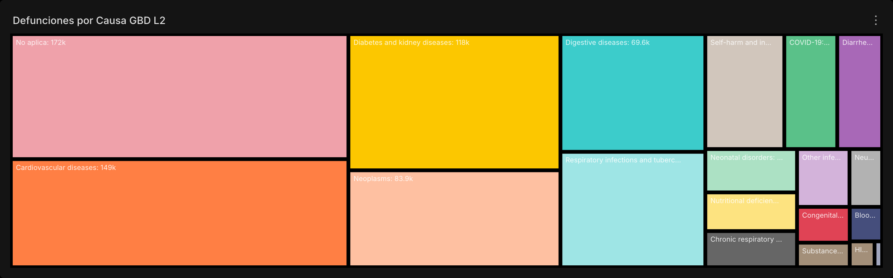

El ranking de las diez causas principales confirma esta distribución y añade granularidad: enfermedades digestivas, infecciones respiratorias, violencia autoinfligida e interpersonal, y enfermedades diarreicas completan el perfil epidemiológico del país. La presencia de causas mal definidas o códigos de síntomas no clasificados (CIE-10 capítulo XVIII) en el ranking sugiere debilidades en la precisión del registro de defunciones.

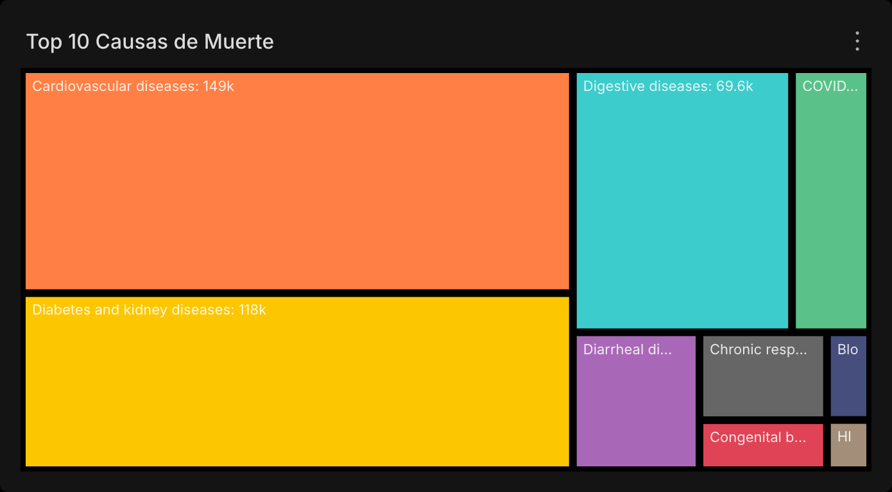

La comparación de la tendencia anual separada por período pre y post-COVID muestra cómo la curva de mortalidad total se dispara a partir de 2020 y se mantiene elevada, consistente con el exceso de mortalidad documentado en el primer dashboard.

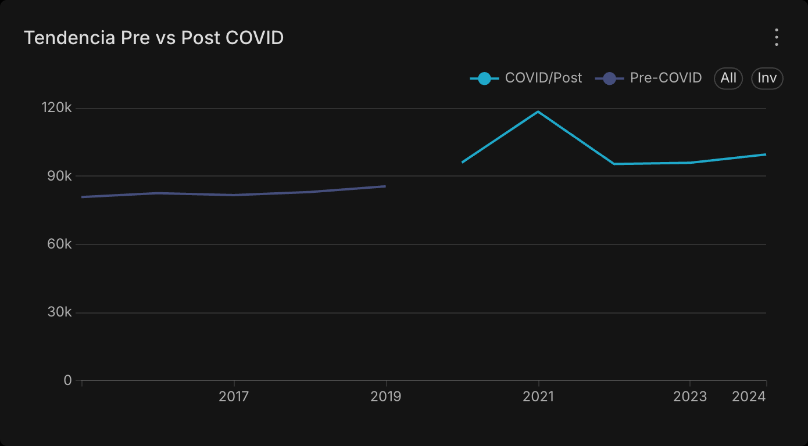

---

El tercer dashboard aborda la dimensión geográfica y demográfica. El treemap de defunciones por departamento revela que Guatemala (departamento central) concentra la mayor cantidad absoluta de defunciones, seguido de Quetzaltenango, Escuintla y Huehuetenango. Esta distribución refleja principalmente la densidad poblacional de cada departamento más que el riesgo relativo, para lo cual se requeriría una tasa con denominador poblacional departamental.

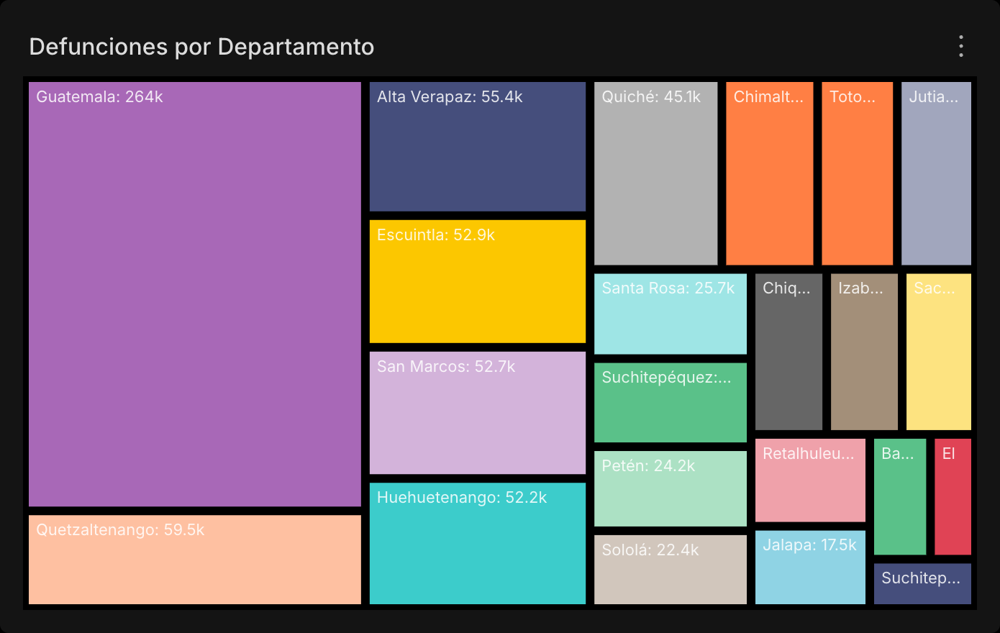

El análisis por grupo etario y año muestra que la población de 60 años o más (vejez) concentra consistentemente la mayor cantidad de defunciones, con un incremento marcado durante 2020–2021 que evidencia el impacto desproporcionado de COVID-19 en este grupo. El grupo de adultez (30–59 años) también experimentó un aumento durante el período pandémico, aunque de menor magnitud relativa.

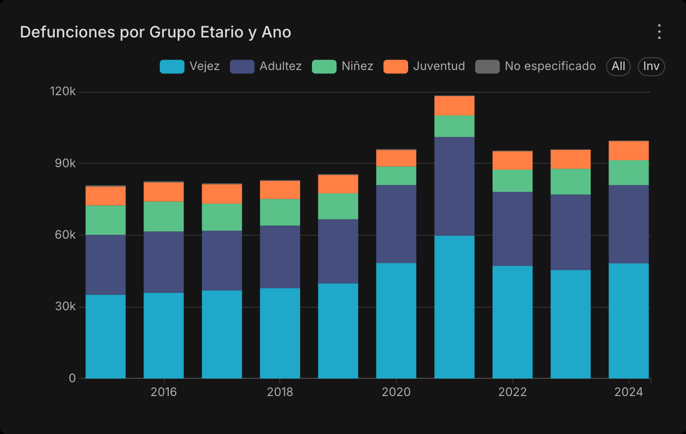

La distribución por sexo confirma la sobremortalidad masculina: los hombres registran consistentemente más defunciones que las mujeres en todos los años de la serie. La brecha se amplió durante 2020–2021, posiblemente por una combinación de mayor exposición laboral, comorbilidades prevalentes y menor búsqueda de atención médica en la población masculina.

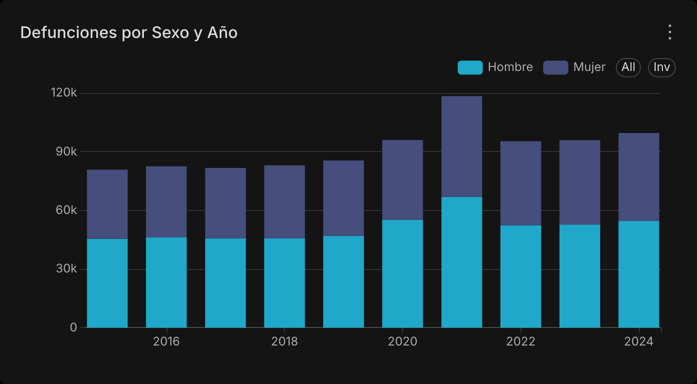

Finalmente, la tabla dinámica de departamento por causa permite identificar perfiles diferenciados: ciertos departamentos del altiplano y el corredor seco muestran una mayor proporción relativa de causas prevenibles (enfermedades infecciosas, desnutrición, complicaciones del embarazo), mientras que en los departamentos urbanos predominan las enfermedades crónicas y las causas externas. Este nivel de desagregación es crítico para focalizar intervenciones de política pública diferenciadas por territorio.

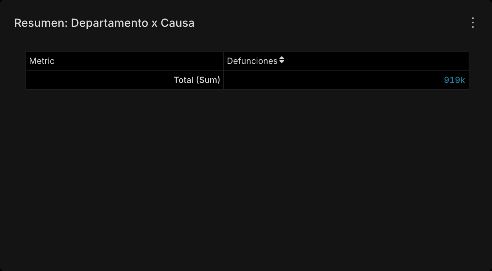

---

## Obtención de dashboards

Estos insights fueron obtenidos gracias a las visualizaciones gráficas realizadas en las distintas herramientas propuestas para el desarrollo del proyecto. A continuación se presentan las formas de obtenerlos.

### Apache Superset

Para reproducir los dashboards de Apache Superset de forma local se utiliza el Makefile ubicado en `bi/`. El flujo esperado es:

```bash
# 1. Asegurar que Greenplum esté levantado y en la red mortality-net
cd scripts/dw
make up

# 2. Desde la raíz del proyecto, cargar las vistas usadas por Superset
docker exec -i -u gpadmin dw-greenplum \
  /usr/local/greenplum-db/bin/psql -h localhost -U gpadmin -d dw_semis2 \
  < sql/views_superset.sql

# 3. Levantar y configurar Superset
cd bi
make up
make init
make db
make setup
make post-setup
```

Luego ingresar a [http://localhost:8088](http://localhost:8088) con `admin/admin`. Los dashboards quedan disponibles como:

- **Dashboard 1:** Pre vs Post COVID — Guatemala
- **Dashboard 2:** Causas de Muerte
- **Dashboard 3:** Geografía y Demografía

### Power BI

Puedes descargar el dashboard de Power BI con el siguiente enlace:
[Descargar Dashboard Power BI](Semis2_Dashboard.pbix.zip)
