# Arquitectura del Sistema

## Descripción General

Para dar una solución a los requerimientos del proyecto, se ha optado por tomar una arquitectura híbrida, que pueda interoperar infraestructura on-premise y en la nube, utilizando tecnologías como databricks, Azure, Power BI, Greenplum, Apache Superset entre otras. Esta arquitectura permite aprovechar las ventajas de ambas infraestructuras, como la escalabilidad y flexibilidad de la nube, así como la seguridad y control que ofrece la infraestructura on-premise.

De igual forma, esta arquitectura será iterativa, por lo que se irá ajustando y mejorando a medida que se avance en el desarrollo del proyecto, permitiendo así adaptarse a los cambios y nuevas necesidades que puedan surgir durante el proceso.

En este momento, ya se ha consolidado toda la arquitectura como tal, y se ha definido un diagrama de arquitectura de solución que representa los diferentes componentes del sistema y su interacción entre ellos. Este diagrama es fundamental para entender cómo se integran las diferentes partes del sistema y cómo se gestionan los datos a lo largo de todo el proceso.

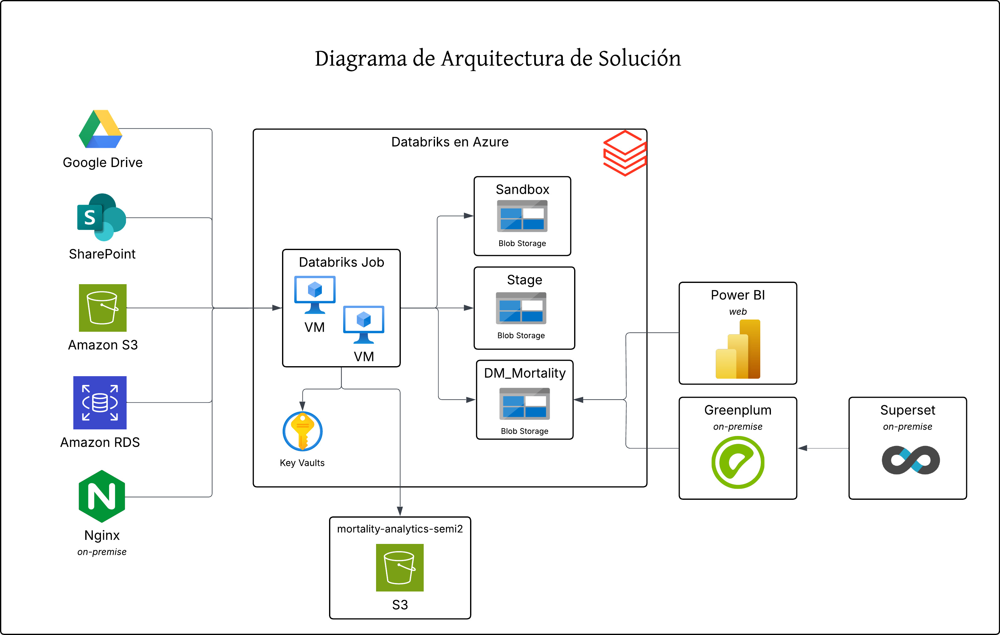

Actualmente, se ha empezado el desarrollo de la parte de extracción y almacenamiento de datos, utilizando databricks como herramienta principal para llevar a cabo esta tarea. Como bien se sabe, databricks debe operarse sobre una infraestructura, y en este caso se ha optado por utilizar Azure como plataforma de nube para alojar databricks y aprovechar sus servicios asociados.

Por otra parte, se ha optado por utilizar fuentes heterogéneas para la extracción de datos, como lo son SharePoint, Google Drive, AWS S3, AWS RDS y un web server en local con Nginx. Esto se debe a que se busca tener una solución flexible y adaptable a diferentes fuentes de datos, permitiendo así integrar información de diversas plataformas y sistemas.

El Sandbox que servirá tanto para manipular data que se redirigirá al data warehouse tanto local como en la nube, estará gestionado por databricks, no se plantea replicarlo en local, ya que, se consideraría redundancia y almacenamiento innecesario. Por su parte, el stage será el lugar donde se procesarán y transformarán los datos para luego ser cargados al data warehouse, que como los requerimientos lo han planteado, tendría que gestionarse de manera inteoperable e híbrida un data warehouse en la nube y otro local, para así aprovechar las ventajas de ambas infraestructuras y garantizar la disponibilidad y accesibilidad de los datos para su análisis y consulta.

Para suplir la necesidad del data warehouse local, se ha optado por utilizar Greenplum, el cual es un exelente sistema de gestión de bases de datos relacional orientado a la analítica y el procesamiento de grandes volúmenes de datos. Este mismo, se da a la tarea de ir a traer la data ya procesada y almacenada en la cpaa gold, para luego ser consultada y analizada de manera eficiente. Además, Greenplum es compatible con SQL, lo que facilita la consulta y análisis de los datos almacenados en el data warehouse local.

Ahora bien , para la visualización de los datos, se ha optado por utilizar herramientas como Power BI y Apache Superset, las cuales permiten crear dashboards interactivos y visualizaciones de datos de manera sencilla y eficiente. Estas herramientas se integran con el data warehouse en la nube y el data warehouse local, permitiendo así acceder a los datos desde ambos entornos y generar informes y análisis de manera rápida y efectiva.

Finalmente, para almacenar todos aquellos outputs y componentes necesarios para llevar a cabo la implementación de Machine Learning, se ha optado por utilizar en AWS un bucket de S3. Este bucket se utilizará para almacenar los modelos entrenados, los resultados de las predicciones y cualquier otro componente necesario para llevar a cabo la implementación de Machine Learning, permitiendo así tener un repositorio centralizado y accesible desde diferentes entornos y herramientas.

## Diagrama de despliegue

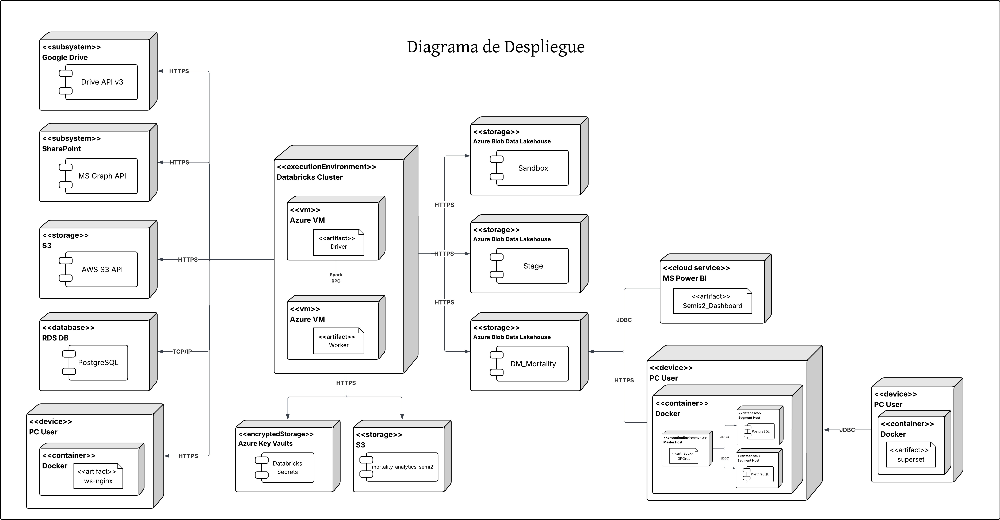

Como se puede observar en el diagrama de despliegue, el sistema está compuesto por varios componentes que interactúan entre sí para cumplir con los requerimientos del proyecto. En primer lugar, se encuentran las fuentes de datos heterogéneas, cada uno representado por un nodo distinto, los cuales, se comunican con databricks a través de diferentes protocolos. Mientras tanto, databricks en sí, su arquitectura es una de tipo distribuida, la cual se divide en 2 principales componentes, el driver y los workers. El driver es el componente encargado de coordinar la ejecución de las tareas y gestionar la comunicación entre los workers, mientras que los workers son los encargados de ejecutar las tareas asignadas por el driver y procesar los datos. Además, databricks se encuentra alojado en Azure, lo que permite aprovechar los servicios de almacenamiento como Blob Storage para almacenar los datos procesados y transformados, así como también para facilitar la integración con otras herramientas y servicios en la nube.

Asímismo, se puede observar que el cluster de datarbricks, aparte de trabajar conjunto a su storage en Azure, también utiliza secrets para gestionar de manera segura las credenciales y configuraciones necesarias para acceder a las diferentes fuentes de datos y servicios en la nube. Esto es fundamental para garantizar la seguridad y confidencialidad de la información, evitando así posibles vulnerabilidades y riesgos asociados con el manejo de datos sensibles.

Por otro lado, en la esquina inferior derecha del diagrama, se puede observar un nodo que representa el data warehouse local, el cual se encuentra gestionado por Greenplum. Este componente es fundamental para almacenar y gestionar los datos procesados y transformados, permitiendo así su consulta y análisis de manera eficiente. La comunicación entre databricks y el data warehouse local se realiza a través de una conexión segura, lo que garantiza la integridad y confidencialidad de los datos durante su transferencia, por medio de consultas a la API que databricks ofrece para este tipo de casos.

De igual forma, se puede resaltar el hecho que el diagrama también logra evidenciar la presencia de las herramientas de visualización de datos, como Power BI y Apache Superset. Por su parte, Power BI se estaría ejecutando en su versión web, es por ello, que se puede observar que está conectado a databricks. Mientras tanto, Apache Superset se decidió que se montaría de manera local y trabajaría conuntamente de manera on-premise con el data warehouse local. Finalmente, se puede añadir el hecho que para almacenar todos aquellos artefactos producidos en consecuencia de la implementación de Machine Learning, se ha optado por utilizar un bucket de S3 en AWS, el cual se encuentra representado en la parte superior del diagrama, que en sí, solo interactúa con el cluster de databricks.

## Modelado de datos

Actulamente, el modelado de datos se encuentra en proceso iterativo. A medida que se avanza en el desarrollo del proyecto, se van identificando nuevas entidades y relaciones que deben ser incorporadas al modelo de datos. Este proceso es fundamental para asegurar que el sistema pueda manejar eficientemente la información y cumplir con los requisitos funcionales establecidos.

### Sandbox

Se ha modealdo el Sandbox, el cual es un esquema de base de datos que contiene un conjunto de tablas las cuales se utilizan para almacenar la información en crudo y sin ser procesada aún. El Sandbox es una parte fundamental del sistema, ya que permite almacenar los datos de manera temporal antes de ser procesados y transformados para su uso en otras partes del sistema. En sí, el Sandbox estaría representando la capa bronce de la arquitectura.

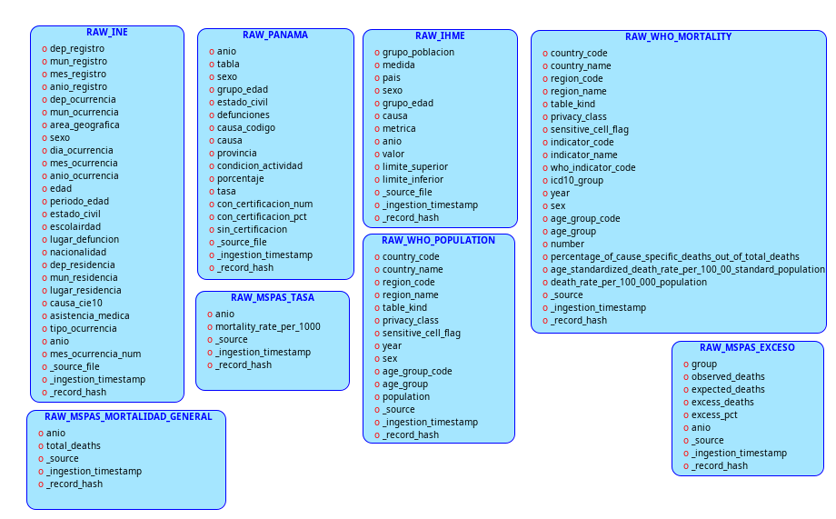

### Stage

Se ha modealdo el Stage, el cual es un esquema de base de datos que contiene un conjunto de tablas las cuales se utilizan para almacenar la información procesada y transformada. El Stage es una parte fundamental del sistema, ya que permite almacenar los datos de manera temporal antes de ser cargados al data warehouse. En sí, el Stage estaría representando la capa plata de la arquitectura medallón que se está implementando en el proyecto en el caso de los datos.

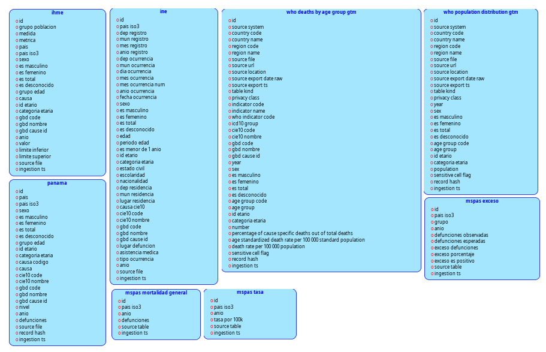

### Fact-Dimensions

En el caso de las tablas Fact-Dimensions, se ha modelado un conjunto de tablas que representan las dimensiones y hechos del modelo dimensional. Estas tablas son fundamentales para el análisis de datos, ya que permiten organizar la información de manera estructurada y facilitar la consulta y análisis de los datos. En sí, las tablas Fact-Dimensions estarían representando la capa oro de la arquitectura medallón que se está implementando en el proyecto.

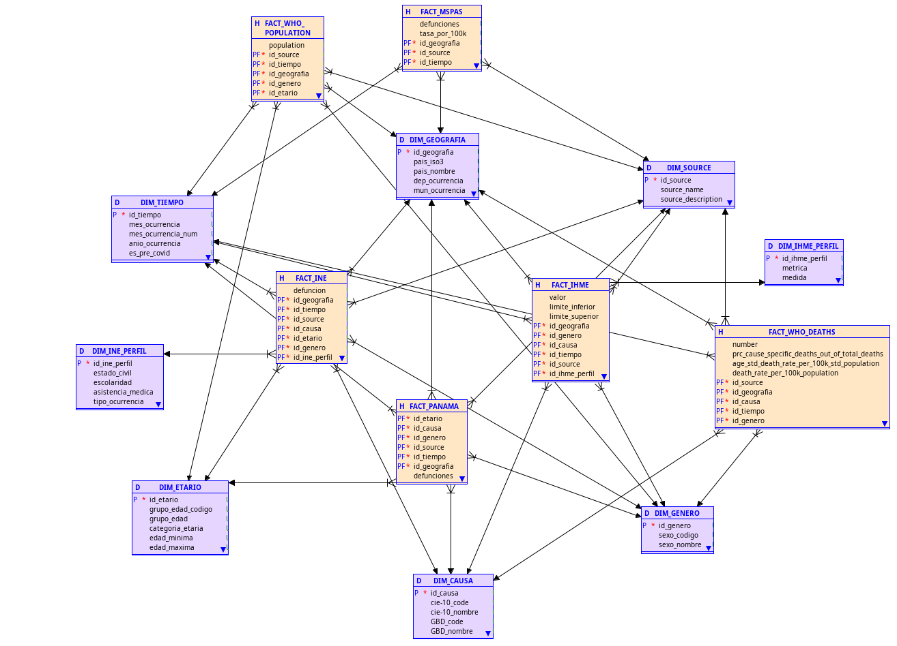

#### Cubos

De igual forma, para que sea visualmente más interpretable, se ha modelado de manera individual cada cubo con sus respectivas dimensiones y hechos, para así facilitar la comprensión de la estructura de cada uno de los cubos y su relación con las demás tablas del modelo dimensional.

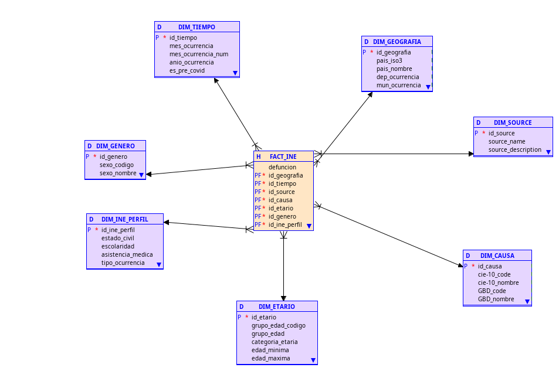
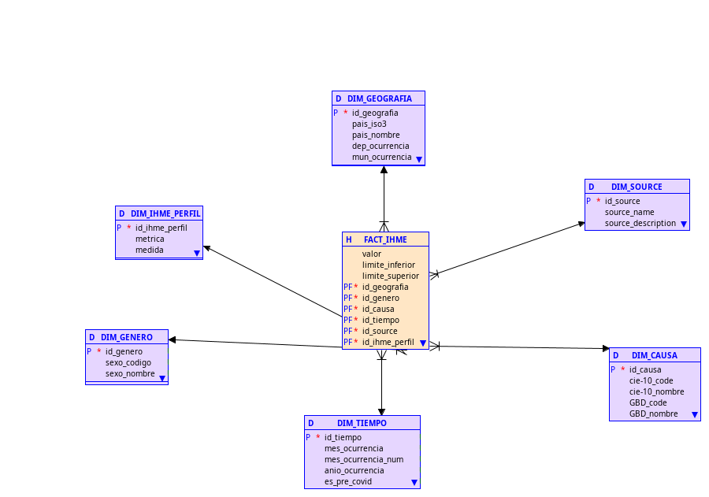
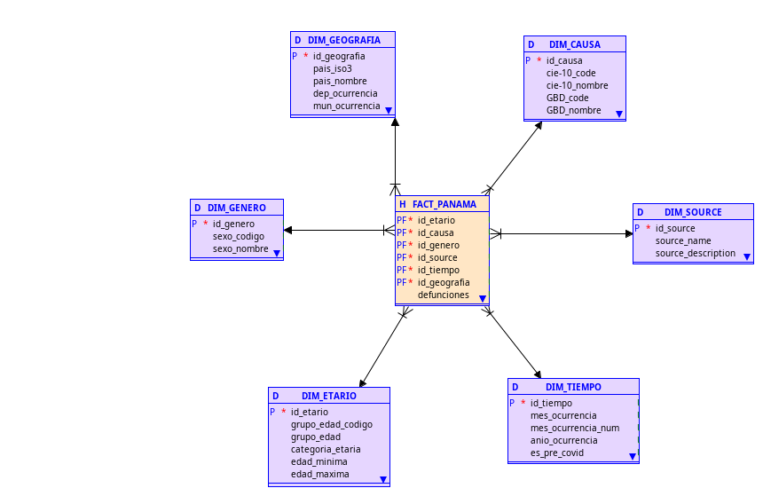
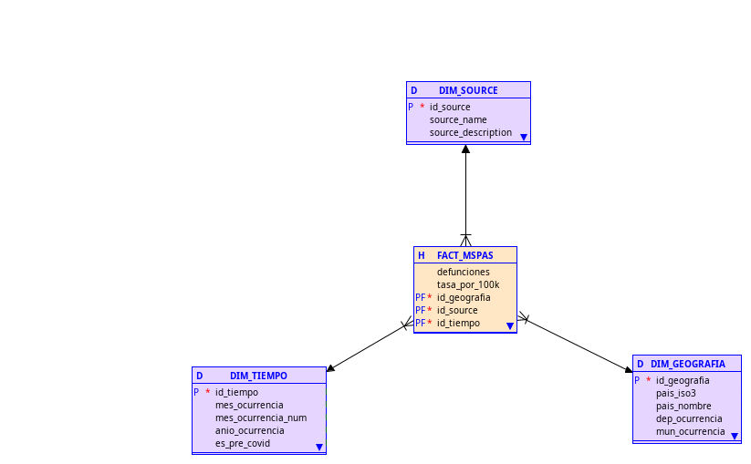
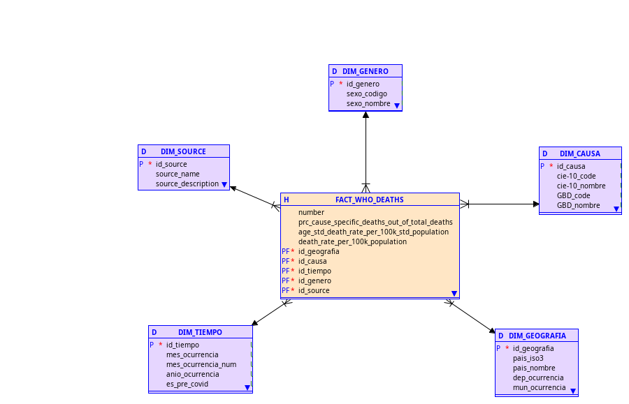
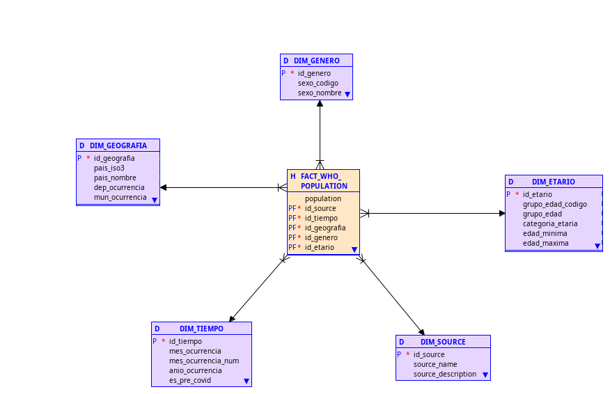

Cabe señalar que en este caso, todo este tipo de modelado se ha enfocado más en la realización del modelo estrella, el cual es un tipo de modelo dimensional que se caracteriza por tener una tabla central de hechos que se conecta a varias tablas de dimensiones. Este tipo de modelo es comúnmente utilizado en sistemas de inteligencia empresarial y análisis de datos, ya que permite organizar la información de manera eficiente y facilitar la consulta y análisis de los datos.

## Decisiones de arquitectura

Se ha optado por la utilización de databricks como la herramientra principal para la extracción y almacenamiento de datos, debido a su capacidad para manejar grandes volúmenes de datos y su integración con diversas fuentes de datos.
Apesar que databricks no sea una herramienta únicamente para la gestión de un data warehouse, sino que para un lakehouse, se decidió utilizarlo porque como se conoce en la teoría, un lakehouse es una arquitectura que combina las ventajas de un data warehouse y un data lake, permitiendo almacenar datos estructurados y no estructurados en un mismo lugar. Además, databricks ofrece funcionalidades esenciales para la gestión de datos, como operaciones ACID y procesamiento de datos distribuidos, lo que lo convierte en una opción adecuada para el proyecto.

Asímismo, se puede comentar que para darle una solución al poder compartir datos desde local, se optó por utilizar un web server que corre con Nginx. Recordemos que Nginx es un servidor web de código abierto que se utiliza para servir contenido web y manejar solicitudes HTTP. En este caso, se ha configurado Nginx para servir los archivos de datos desde el entorno local, permitiendo así que databricks pueda acceder a ellos a través de una URL. Esta solución es eficiente y sencilla de implementar, ya que no requiere la configuración de un servidor FTP o la utilización de servicios en la nube para almacenar los datos. Dicho sea de paso, los demás orígenes de fuentes heterogéneas se han utilizado dado que entre los requerimientos del proyecto se hacía solicitud de estos.

Ante la sitaución que se está implementando un data warehouse que en su principio está siendo en la nube, el proceso de consolidación del mismo, sería un ELT y no un ETL, ya que, se está utilizando databricks para extraer los datos y almacenarlos en su forma cruda en el Sandbox, para luego ser procesados y transformados dentro de databricks antes de ser cargados al data warehouse. Este enfoque permite aprovechar las capacidades de procesamiento de databricks y optimizar el rendimiento del sistema, ya que se evita la necesidad de transferir grandes volúmenes de datos entre diferentes sistemas durante el proceso de transformación.

Para resnponder la necesidad de tener un data warehouse local, se ha optado por utilizar Greenplum, el cual es un sistema de gestión de bases de datos relacional orientado a la analítica y el procesamiento de grandes volúmenes de datos. Greenplum ofrece funcionalidades avanzadas para el manejo de datos, como particionamiento, paralelismo y optimización de consultas, lo que lo convierte en una opción adecuada para el proyecto. Además, Greenplum es compatible con SQL, lo que facilita la consulta y análisis de los datos almacenados en el data warehouse local. Su sistema es de tipo MPP (Massively Parallel Processing), lo que significa que puede distribuir la carga de trabajo entre múltiples nodos, lo que mejora el rendimiento y la escalabilidad del sistema.

Ahora bien, la interoperabilidad entre el data warehouse en la nube y el data warehouse local se logra a través de la conexión segura que se establece entre databricks y Greenplum. Esta conexión realizada mediante la API de datarbicks nos permite obtener los datos procesados y transformados en databricks y cargarlos al data warehouse local, lo que garantiza la disponibilidad y accesibilidad de los datos para su análisis y consulta desde ambos entornos. Esta solución permite aprovechar las ventajas de ambas infraestructuras, como la escalabilidad y flexibilidad de la nube, así como la seguridad y control que ofrece la infraestructura on-premise.

Hablando un poco sobre las herramientas de visualización de datos, se ha optado por utilizar Power BI, ya que, esta plataforma desarrollada por Microsoft, es uno de los productos líderes de la actualidad para esta tarea en especial. Lo que trae de grandioso Power BI, es que, además de su facilidad en la creación e interacción con dashboards, este posee 2 herramientras esenciales y poderosas en estos entornos, los cuales serian Power Query y Dax. Además de ello, Power BI ofrece una amplia gama de conectores y opciones de integración con diferentes fuentes de datos, lo que facilita la conexión con cualquier de los dos data warehouse. Adicionalmente, Power BI permite cargar la data en memoria primaria, lo que mejora el rendimiento y la velocidad de las consultas y análisis de datos. Asimismo, esta plataforma ofrece la posibilidad de cargar modeloados de datos como el de estrella o copo de nieve, de manera nativa, facilitando así la interacción con los datos.

Por otra parte, Apache Superset, es otra herramienta de visualización de datos que se ha optado por utilizar en el proyecto. Superset es una plataforma de código abierto que permite también la creación de dashboards efectivos. Este, a diferencia de Power BI, no almacena o carga la data en memoria, sino que, se conecta directamente a la fuente de datos para realizar las consultas y generar las visualizaciones, es por ello que se le llama SQL Native. Esta herramiente, puede correr tanto Web como en local, y es compatible con una amplia gama de bases de datos y sistemas de almacenamiento de datos, lo que facilita la integración con los data warehouse.
