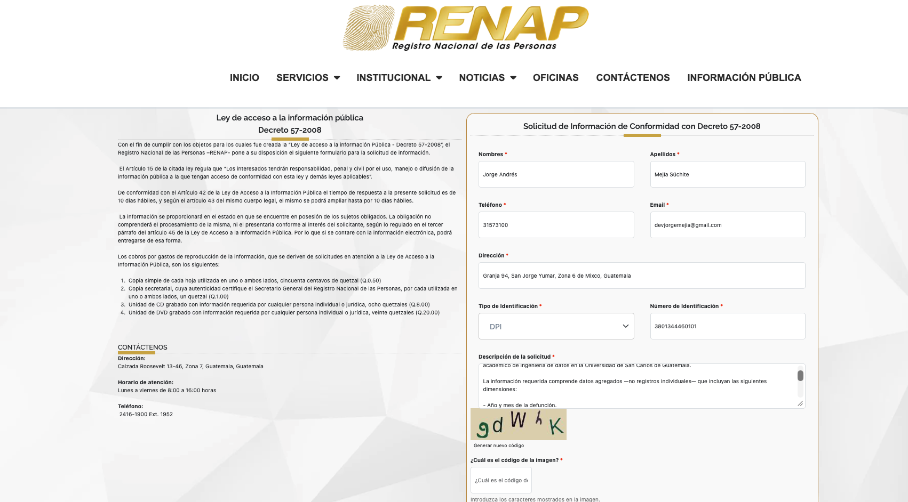

# Fuentes de Datos

| ID | Fuente | Granularidad | Período | Estado |
|----|--------|-------------|---------|--------|
| DS-01 | INE Guatemala — microdatos defunciones | Municipio + CIE-10 | 2015–2024 | Disponible |
| DS-02 | MSPAS — estadísticas vitales | Nacional | 2001–2024 | Disponible |
| DS-03 | IHME GBD 2023 — Centroamérica | País + causa | 1990–2023 | Disponible |
| DS-04 | Panamá INEC — defunciones | Provincial | 2015–2024 | Disponible |
| DS-05 | WHO Mortality Database | País + CIE-10 | 2015–2022 | Disponible con limitación |
| DS-06 | PAHO Core Indicators | País/región | 1995–2026 | Pendiente |
| DS-07 | INEC Costa Rica | Provincia + CIE-10 | 2002–2024 | Pendiente |
| DS-08 | RENAP Guatemala | Municipio | 2015–2024 | Solicitud enviada |

---

## DS-01 · INE Guatemala

El INE publica anualmente microdatos de defunciones no fetales en `datos.ine.gob.gt`. Cada fila corresponde a una defunción individual codificada bajo CIE-10. Los datos provienen de los libros de inscripción del RENAP.

Los archivos 2018–2024 están disponibles públicamente sin registro. Se descargaron con `curl` y se subieron a Google Drive (`semis2_raw_data/ine/`) como fuente centralizada.

| Archivo | Año | Tamaño |
|---------|-----|--------|
| `defunciones_2018.xlsx` | 2015 | 9.5 MB |
| `defunciones_2018.xlsx` | 2016 | 9.0 MB |
| `defunciones_2018.xlsx` | 2017 | 9.7 MB |
| `defunciones_2018.xlsx` | 2018 | 9.3 MB |
| `defunciones_2019.xlsx` | 2019 | 9.4 MB |
| `defunciones_2020.xlsx` | 2020 | 10 MB |
| `defunciones_2021.xlsx` | 2021 | 13 MB |
| `defunciones_2022.xlsx` | 2022 | 10 MB |
| `defunciones_2023.xlsx` | 2023 | 10 MB |
| `defunciones_2024.xlsx` | 2024 | 9.7 MB |
| `diccionario_2018_2022.xlsx` | Referencia | 430 KB |

**Notas de calidad:** los datos de 2024 pueden ser preliminares. Usar `Añoocu` (año de ocurrencia) para análisis temporal, no `Añoreg`, ya que pueden diferir cuando hay rezago en la inscripción. Registros sin municipio se tratan como `"Desconocido"`.

La data obtenida fue recolectada a través de los siguientes enlaces:

[Mortaldiad INE 2015-2017](https://www.ine.gob.gt/vitales/)

[Mortaldiad INE2018-2024](https://datos.ine.gob.gt/dataset/estadisticas-vitales-defunciones)

---

## DS-02 · MSPAS Guatemala

La Dirección de Epidemiología del MSPAS publica estadísticas de mortalidad basadas en SIGSA. Aunque comparte la misma fuente primaria que el INE, presenta los datos con su propia metodología de agregación, lo que lo hace útil para validación cruzada y para cubrir el período 2015–2017 a nivel nacional.

Los archivos se descargaron de `epidemiologia.mspas.gob.gt` y se cargaron a RDS PostgreSQL (`raw_data.*`) para ingesta vía JDBC desde Databricks.

| Archivo | Contenido | Años |
|---------|-----------|------|
| `indicadores_mortalidad_2010_2024.xlsx` | Tasas e indicadores por causa | 2010–2024 |
| `mortalidad_2001_2019.xlsx` | Defunciones históricas por causa | 2001–2019 |
| `top15_causas_mortalidad_ine.xlsx` | Top 15 causas por año | Multi-año |
| `exceso_mortalidad_2022.xlsx` | Exceso de mortalidad COVID-19 | 2020–2022 |

**Notas de calidad:** datos agregados a nivel nacional únicamente. La codificación de causas puede diferir levemente de la del INE antes de 2018.

La data obtenida fue recolectada a través del siguiente enlace:

[Mortalidad MSPAS](https://datosabiertos.mspas.gob.gt/)

---

## DS-03 · IHME GBD 2023

El Global Burden of Disease 2023 del IHME cubre Guatemala, Honduras, El Salvador, Costa Rica, Nicaragua y Panamá entre 1990 y 2023 con 16 causas principales. Los valores son estimaciones estadísticas con corrección por subregistro, no conteos directos de actas de defunción.

El CSV se descargó de `healthdata.org` y se subió a S3 (`s3://mortality-analytics-semi2/raw/ihme/`). El notebook lo descarga desde ahí en cada ejecución.

**Notas de calidad:** los totales para Guatemala pueden diferir de los del INE porque el IHME aplica correcciones por subregistro. Licencia no comercial — uso exclusivamente académico.

La data obtenida fue recolectada a través del siguiente enlace:

[IHME GBD 2023](https://vizhub.healthdata.org/gbd-results/?params=gbd-api-2023-permalink/2922b6b201ff4bd8b37341900b2514b0)

---

## DS-04 · Panamá INEC

El INEC de Panamá publica estadísticas de defunciones en formato XLS con múltiples dimensiones: causa × edad/sexo, causa × provincia/sexo, actividad económica, tasas de mortalidad y certificación médica. Los datos son ya agregados en origen.

**Fuente original:** https://www.inec.gob.pa/buscador/Default.aspx?BUSCAR=defuciones

Los XLS se convirtieron a CSV con `scripts/transformation/panama_excel_to_csv.py` y se subieron a OneDrive (`semi2-mortalidad/panama/`). El notebook los descarga desde ahí vía Microsoft Graph API. Hay 10 archivos en total: `panama_YYYY_csv.csv` para cada año entre 2015 y 2024.

La data obtenida fue recolectada a través del siguiente enlace:

[Mortalidad Panamá INEC](https://www.inec.gob.pa/publicaciones/Default2.aspx?ID_CATEGORIA=3&ID_SUBCATEGORIA=7)

---

## DS-05 · WHO Mortality Database

La OMS recopila registros de causas de muerte de los sistemas de registro civil de los países miembros. Para Guatemala se descargaron los archivos disponibles en la página de WHO Mortality Database y se almacenaron en `data/raw/who_mortality/`. Para la ingesta en Databricks, los archivos se sirven desde un servidor nginx local expuesto como DevTunnel.

El período de análisis del proyecto es 2015–2024; sin embargo, la fuente de WHO para Guatemala solo publicó datos hasta 2022 al momento de la extracción. No se pudieron extraer datos de 2023 ni 2024 porque la página de origen no tenía registros disponibles para esos años. Por esta razón, WHO se utiliza como fuente de referencia para 2015–2022 y no como cobertura completa del período 2015–2024.

| Archivo | Contenido |
|---------|-----------|
| `deaths_by_age_group_gtm.csv` | Muertes por grupo etario e indicador |
| `population_distribution_gtm.csv` | Distribución poblacional |

**Notas de calidad:** la OMS documenta problemas de completitud en los registros de Guatemala anteriores a 2018. Datos solo a nivel país. La cobertura disponible para Guatemala llega hasta 2022; 2023–2024 no están publicados en la fuente consultada. Licencia CC BY-NC-SA 3.0 IGO.

La data obtenida fue recolectada a través del siguiente enlace:

[WHO Mortality Database](https://platform.who.int/mortality/countries/country-details/MDB/guatemala)

## DS-08 · RENAP Guatemala *(solicitud enviada)*

El RENAP inscribe las defunciones antes de que el INE las procese estadísticamente. Se envió solicitud formal el 2026-06-03 bajo la Ley de Acceso a la Información Pública (Decreto 57-2008), solicitando datos agregados de defunciones 2015–2024. Respuesta esperada el 2026-06-18, prorrogable hasta 2026-07-02.

**Evidencia de solicitud:**

---

## Problemas de calidad conocidos

| Fuente | Problema | Tratamiento |
|--------|----------|-------------|
| INE 2015–2017 | No publicados en portal abierto | Solicitud formal enviada; provisional con MSPAS |
| INE todos los años | `Añoreg` puede diferir de `Añoocu` | Usar siempre `Añoocu` para análisis temporal |
| INE todos los años | Registros sin municipio | → `"Desconocido"` en la ingesta |
| INE 2024 | Datos posiblemente preliminares | Marcar como provisional; re-ingestar al publicarse la versión definitiva |
| MSPAS | Solo nivel nacional | Usar INE para análisis geográfico |
| WHO Guatemala pre-2018 | Baja completitud CIE-10 | Solo como referencia; no fuente primaria para Guatemala |
| WHO Guatemala 2023–2024 | Sin registros publicados en la página de origen | No imputar; documentar ausencia y usar otras fuentes para esos años |
