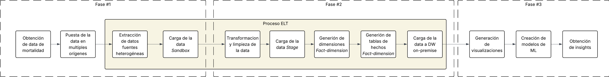

# Plataforma Analítica de Mortalidad End-to-End

**Seminario de Sistemas 2 — Laboratorio de Ingeniería de Datos**  
Universidad de San Carlos de Guatemala · Escuela de Vacaciones 2026

---

## Contexto

Plataforma de datos de punta a punta (End-to-End) para analizar cómo cambiaron los patrones de mortalidad en Guatemala entre el período **pre-COVID (2015–2019)** y el período **post-COVID (2020 en adelante)**, en el marco de una consultoría modelo PNUD/Naciones Unidas.

## Arquitectura por Fases

| Fase       | Foco                                                             | Fecha          |
| ---------- | ---------------------------------------------------------------- | -------------- |
| **Fase 1** | Identificación, estructuración, limpieza e ingesta de datos      | 12 de junio    |
| **Fase 2** | Transformación, arquitectura por capas y Data Warehouse          | 19 de junio    |
| **Fase 3** | Machine Learning, visualización analítica e interoperabilidad BI | 26–30 de junio |

## Fuentes de Datos

| Fuente                 | Tipo                            | Período   | Estado                   |
| ---------------------- | ------------------------------- | --------- | ------------------------ |
| INE Guatemala          | Microdatos defunciones (CIE-10) | 2015–2024 | Disponible               |
| MSPAS                  | Estadísticas vitales agregadas  | 2001–2024 | Pendiente extracción PDF |
| WHO Mortality Database | Guatemala, referencia país      | 2015–2022 | Disponible con limitación |
| PAHO Core Indicators   | Indicadores regionales          | 1995–2026 | Pendiente                |
| INEC Costa Rica        | Microdatos provinciales         | 2002–2024 | Pendiente                |
| RENAP                  | Registros de defunción          | TBD       | Solicitud enviada        |

## Flujo de trabajo

Para este momento, ya se ha consolidado todo el flujo de trabajo para el desarrollo del proyecto, abarcando todo lo requerido planteado con anterioridad. Ya para esta fase, se ha establecido lo que es la extracción de múltiples fuentes heterogéneas, la carga de estos en un Sandbox, el cual, sirve para que posteriormente sea transformada y cargada en un Data Warehouse, el cual, se encuentra estructurado por capas. Todo esto, se ha segmenado en 3 capas con distintas funcionalidades y propósitos. La capa Sandbox que sería los datos en crudo, la capa de Staging que es la capa de datos transformados, y la capa de fact-dimensions ( que sí requiere de un modelado y tratamiento específico) que termina siendo la capa de datos listos para el análisis. Además, se ha podido establecer un proceso de automatización para tener una replica de los datos de manera local y permitiendo que los data warehouses puedan ser interoperables entre sí.Y ya para finalizar, ha sido posible establecer un proceso de visualización de los datos, el cual, permite que los usuarios puedan interactuar con los datos y obtener información relevante para la toma de decisiones.

"

## Integrantes

| Nombre                       | Carné     | Puesto        |
| ---------------------------- | --------- | ------------- |
| Jorge Andrés Mejía Suchite   | 202300376 | Desarrollador |
| Abdiel José Otzoy Otzín      | 202300350 | Desarrollador |
| José Emilio Morales Castillo | 202300636 | Coordinador   |

## Presentación

Para este proyecto, se ha realizado una presentación en la cual se explicaba aspectos claves del proyecto, como lo es la arquitectura de datos, el flujo de trabajo, las fuentes de datos y los resultados obtenidos. La presentación se encuentra disponible en el siguiente enlace:
[Presentación del proyecto](./Presentacion_Grupo_11.pptx)