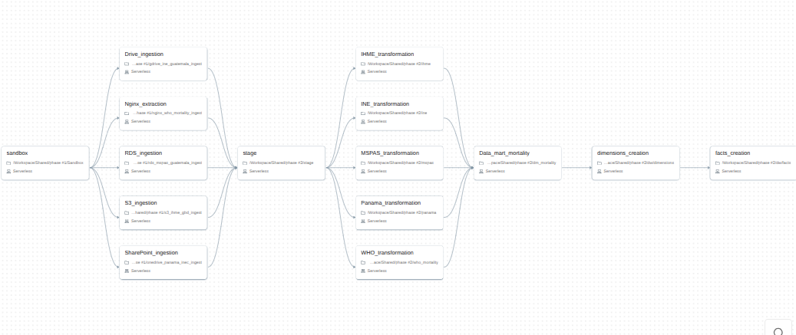
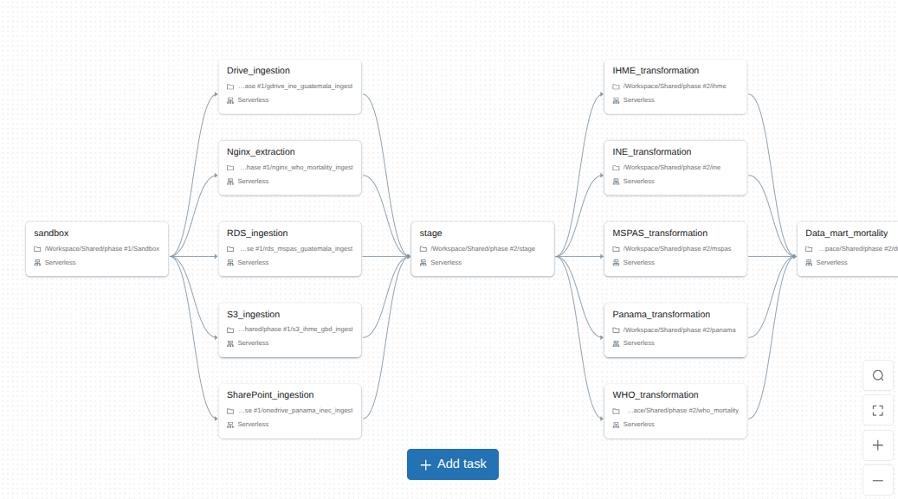
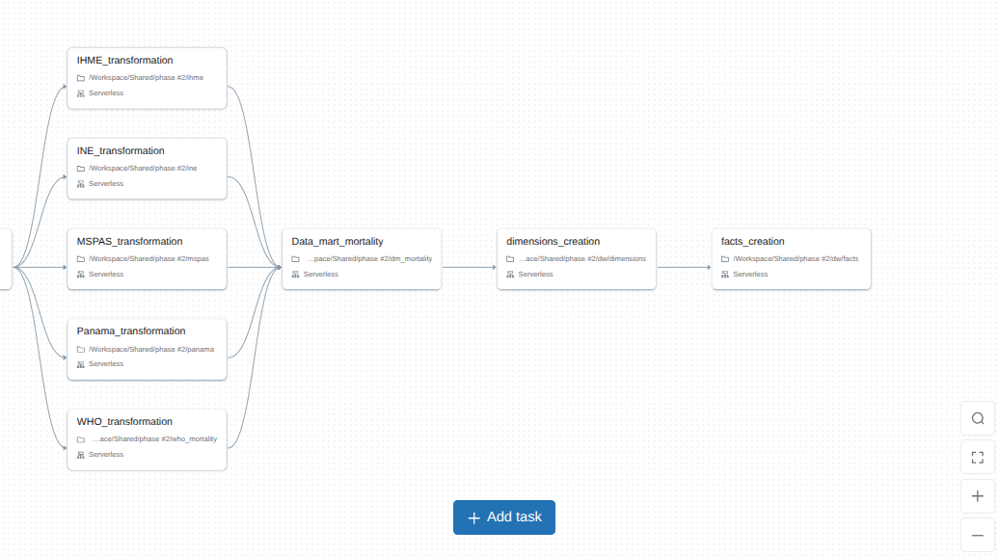
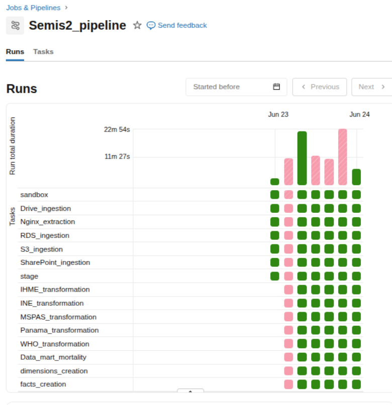
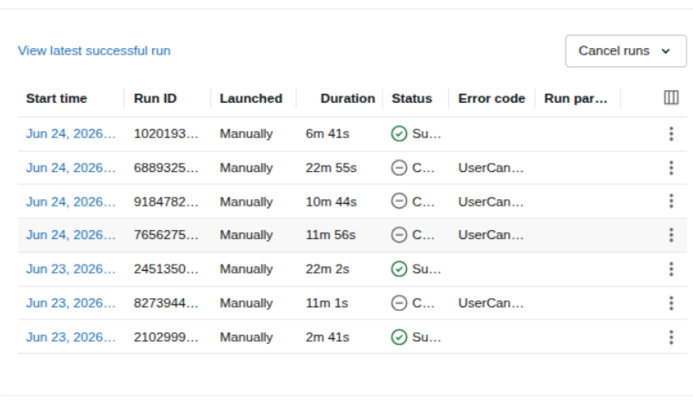
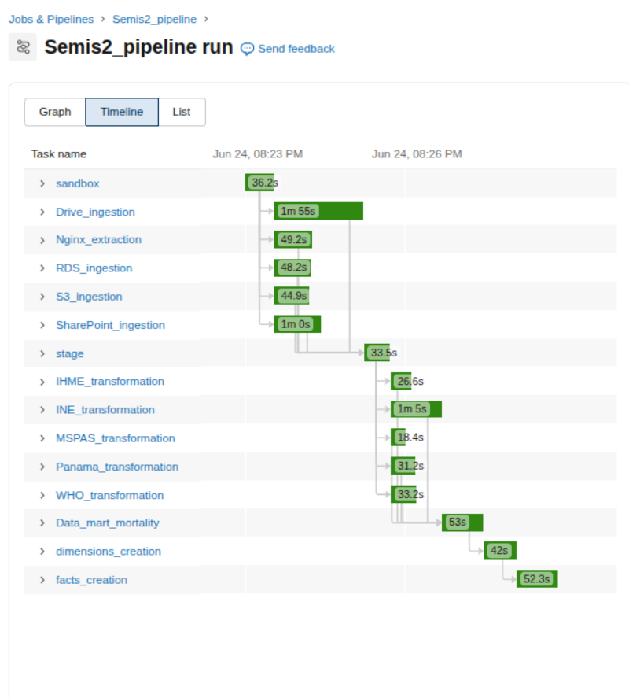

# Pipelines de Ingesta

Los notebooks en `notebooks/` cubren la extracción, transformación y carga al schema `sandbox` en Databricks Delta Lake. Todos leen credenciales desde el scope `semis2_scope`; no hay credenciales en el código.

| Notebook | Fuente | Tabla(s) Delta |
|---|---|---|
| `01_gdrive_sandbox_ingest.py` | Google Drive | Varios |
| `02_ine_guatemala_ingest.py` | Google Drive | `sandbox.raw_ine` |
| `03_mspas_guatemala_ingest.py` | RDS PostgreSQL | `sandbox.raw_mspas_*` |
| `04_ihme_gbd_ingest.py` | AWS S3 | `sandbox.raw_ihme` |
| `05_panama_inec_ingest.py` | OneDrive | `sandbox.raw_panama*` |
| `06_who_mortality_ingest.py` | nginx (DevTunnel) | `sandbox.raw_who_mortality_*` |

---

## 02 · INE Guatemala

Descarga los CSV de defunciones del INE desde Google Drive, los une en un DataFrame y limpia antes de escribir `sandbox.raw_ine`.

**Renombrado de columnas.** Las abreviaturas originales del INE se reemplazan por nombres descriptivos en snake_case: `Depreg → dep_registro`, `Mupreg → mun_registro`, `Caudef → causa_cie10`, `Edadif → edad`, `Sexo → sexo`, `Añoocu → anio_ocurrencia`, etc.

**Causa CIE-10.** Trim + uppercase. Solo se conservan códigos con formato `^[A-Z][0-9]{2}[0-9A-Z]?$`; el resto queda `null`.

**Edad.** Edades en meses se convierten a `0` años. Valores fuera de `[0, 120]` quedan `null`.

**Columnas eliminadas.** Se eliminan `Puedif` (etnia), `Pnadif`, `Dnadif`, `Mnadif` (lugar de nacimiento), `Cerdef`, `Mredof`. Son quasi-identificadores sin valor analítico para el proyecto; ver [Gobernanza](gobernanza.md).

**Valores nulos.** `"Ignorado"` → `null`. Las columnas categóricas que quedan en `null` se rellenan con `"Desconocido"` o `"No Especificado"` según corresponda. Las columnas numéricas como `edad` y `dia_ocurrencia` se mantienen en `null` para no sesgar distribuciones.

**Deduplicación.** `dropDuplicates()` al final.

---

## 03 · MSPAS Guatemala

Lee tres tablas de RDS vía JDBC. No se unifican porque tienen esquemas distintos y miden fenómenos diferentes.

| Tabla RDS | Tabla Delta | Contenido |
|---|---|---|
| `raw_data.mspas_exceso_mortalidad_2022` | `sandbox.raw_mspas_exceso` | Exceso vs. esperado (2020–2022) |
| `raw_data.mspas_mortalidad_general_2010_2024` | `sandbox.raw_mspas_mortalidad_general` | Totales anuales (2010–2024) |
| `raw_data.mspas_tasa_mortalidad_2001_2019` | `sandbox.raw_mspas_tasa` | Tasas por causa (2001–2019) |

Transformaciones sobre cada tabla: normalización de nombres de columnas a snake_case, `year → anio`, todas las variantes de `"Ignorado"` → `null`, años fuera de 2000–2030 → `null`, `dropDuplicates()`.

---

## 04 · IHME GBD 2023

Descarga el CSV desde S3 y escribe `sandbox.raw_ihme`.

**Columnas traducidas al español:** `location → pais`, `sex → sexo`, `age → grupo_edad`, `cause → causa`, `metric → metrica`, `year → anio`, `val → valor`, `upper/lower → limite_superior/limite_inferior`.

**Tipos:** `anio` → Integer; `valor`, `limite_superior`, `limite_inferior` → Double.

**Valores negativos en `valor`** → `null` (la fila se conserva para no perder el resto de dimensiones).

**Estandarización:** `Both/Male/Female → Ambos/Hombre/Mujer`; `Number/Rate/Percent → Número/Tasa/Porcentaje`.

`dropna` sobre `pais`, `causa`, `anio`, `valor`. `dropDuplicates()` al final.

---

## 05 · Panamá INEC

Descarga 10 CSV anchos desde OneDrive vía Microsoft Graph API con autenticación MSAL device-flow. Los archivos vienen como `panama_YYYY_csv.csv`, usan `;` como separador y contienen solo `Código`, `Sexo` y grupos de edad.

**Sandbox (`notebooks/sandbox/onedrive_panama_inec_ingest.py`):** descarga los CSV, los une con `allowMissingColumns=True` y los escribe tal cual en `sandbox.raw_panama`.

**Staging (`notebooks/staging/panama.py`):** normaliza encabezados, deriva `anio` desde el nombre del archivo y deshace la tabla ancha a formato largo por `causa_codigo`, `sexo`, `grupo_edad` y `defunciones`.

**Limpieza:** `"-"`, `".."`, `"Ignorado"` → `null`. `sexo` solo acepta `"Hombres"` y `"Mujeres"`. `causa_codigo` acepta códigos numéricos, rangos con `y`, valores alfanuméricos y variantes con punto/guion. `dropDuplicates()` al final.

| Tabla Delta | Contenido |
|---|---|
| `sandbox.raw_panama` | CSV ancho crudo de Panamá |
| `stage.panama_causa_edad_sexo` | Versión larga por causa, sexo y grupo de edad |

---

## 06 · WHO Mortality Database

Descarga los CSV disponibles desde nginx. Actualmente se cargan `deaths_by_age_group_gtm.csv` y `population_distribution_gtm.csv`; cada archivo tiene líneas de metadatos antes del encabezado y `split_metadata_and_csv()` las separa antes de leer con Spark.

La ingesta conserva únicamente los años disponibles en la fuente original. Aunque el período objetivo del proyecto es 2015–2024, la página de WHO Mortality Database para Guatemala no tenía datos publicados para 2023 ni 2024 al momento de la extracción; por lo tanto, esos años no se cargan ni se imputan desde WHO. La ausencia corresponde a la disponibilidad de la fuente, no a un error del pipeline.

**Normalización:** snake_case en nombres de columna, trim en strings, vacíos → `null`.

**Indicadores** (`deaths_by_age_group`): `indicator_code` en uppercase; `sex` normalizado a `all/male/female`; grupos de edad mapeados al estándar WHO; años fuera de rango → `null`; negativos en `number` → `null`; porcentajes fuera de `[0,100]` → `null`; hash SHA-256 por fila como `record_hash`; deduplicación.

**Población** (`population_distribution`): misma normalización de sexo, edad y año; `sanitize_non_negative` sobre `population`.

Cada fila recibe columnas de trazabilidad: `source_system`, `country_code`, `country_name`, `source_file`, `source_url`, `table_kind`, `privacy_class`, `ingestion_ts`.

## Trazabilidad del pipeline

En esta ocasión, se pedia la realización de un pipeline de datos end to end, que abarca desde la extracción de datos de diversas fuentes hasta su transformación y carga a un modelo dimensional. A continuación, se detallan los pasos y las evidencias de las ejecuciones del pipeline.    

